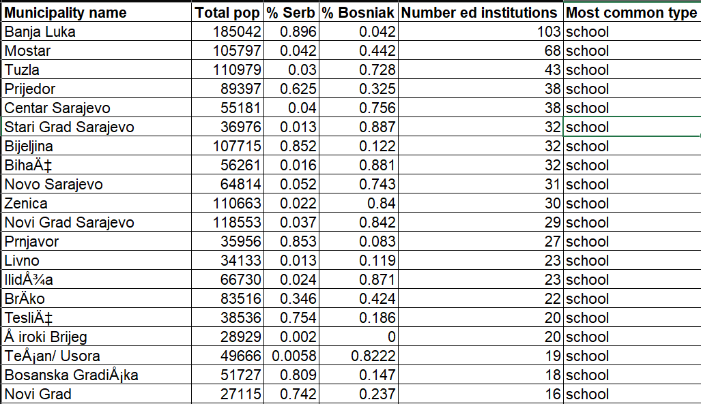

## Demographic and openstreetmap data in Bosnia-Herzegovina
### Jamie Bastian
### GTECH 78519 Fall 2022

Bosnia-Herzegovina (Bosnia) is a country in southeastern Europe. It borders Croatia, Serbia, and Montenegro. Bosnia has significant ethnic Bosniak, Serb, and Croatian communities. Republika Srpska is an autonomous region within Bosnia with a mostly Serb population. The rest of the country is known as the Federation of Bosnia-Herzegovina, with a mostly Bosniak population. Generally, Serbs in Bosnia are orthodox Christians, while Bosniaks are muslim.
<br>
<br>
This project involved building a spatial database with demographic and other data in Bosnia-Herzegovina. The main data sources were the 2013 Bosnian census and OpenStreetMap. The 2013 census data used in this project included numbers and percent of Bosniaks, Serbs, Croats, Orthodox Christians, Catholics, and Muslims.
<br>
<br>
Data from OpenStreetMap, a crowd-sourced mapping project, was also used. Raw OpenStreetMap data contains information on administrative boundaries, transportation, and points of interest. For this project, OpenStreetMap data was used to create tables for various amenities within Bosnia, including health facilities, educational facilities, religious places, and restaurants.

### Steps and SQL used in the project:

The first step of the project was to download OpenStreetMap data for Bosnia. I downloaded a pre-generated file of all osm data for Bosnia from the OpenStreetMap website. This dataset was in a vector tile layer. I used the osm2pgsql tool to load this vector tile layer into a PostGIS database.
<br>
Here is the command line prompt to load osm data:
```console
"C:\Users\jdbas\Downloads\osm2pgsql-latest-x64\osm2pgsql-bin\osm2pgsql.exe" -c -d osm -U postgres -W -H 127.0.0.1 -S "C:\Users\jdbas\Downloads\default.style" "C:\Users\jdbas\Downloads\bosnia-herzegovina-latest.osm.pbf"
```


At this point, I had the osm data in PostGIS. There were four total tables: points, lines, polygons, and roads. The only tables that I was interested in were the points and polygons, since that is where all the amenities are stored. There were a few data cleanup and processing steps, including confirming SRIDs, adding a new geometry column, and checking for simple and valid polygons.
```sql
--Checking SRID of the osm data
SELECT ST_SRID(way) FROM planet_osm_point;
--osm data is in EPSG 3857, WGS pseudo-Mercator

--EPSG 8677 is for Bosnia, distance unit is meters
SELECT * FROM spatial_ref_sys
WHERE auth_srid = 8677;
--Add a geometry column to the osm point data and set to EPSG 8677
ALTER TABLE planet_osm_point 
ADD COLUMN geom_m geometry;
UPDATE planet_osm_point
SET geom_m = ST_Transform(way, 8677);
SELECT ST_Transform(geom_m, 4326)
FROM planet_osm_point
LIMIT 100;

--Add a geometry column to the osm polygon data and set to EPSG 8677
ALTER TABLE planet_osm_polygon 
ADD COLUMN geom_m geometry;
UPDATE planet_osm_polygon
SET geom_m = ST_Transform(way, 8677);
SELECT ST_Transform(geom_m, 4326)
FROM planet_osm_polygon
LIMIT 100;

--Making sure all polygons are simple and valid
SELECT * FROM planet_osm_polygon
WHERE not ST_IsSimple(geom_m) or not ST_IsValid(geom_m);
```

The next step was to load the demographic data, which was joined to a shapefile with municipal boundaries in QGIS. I confirmed the SRID of the shapefile in QGIS and added a new geometry column to match the geometry columns of the osm data. I also created a spatial index using GIST on the municipalities shapefile.
```sql
--Loaded the municipalities shapefile in QGIS and confirmed the SRID is 4326
SELECT UpdateGeometrySRID('bos_mun', 'geom', 4326);
--Adding a column for a SRID in meters
ALTER TABLE bos_mun
ADD COLUMN geom_m geometry;
UPDATE bos_mun
SET geom_m = ST_Transform(geom, 8677);
--Confirming the new geometry column looks OK by reprojecting to 4326
SELECT ST_Transform(geom_m, 4326)
FROM bos_mun;
--Creating spatial index
CREATE INDEX mun_geomm_id
ON bos_mun
USING GIST (geom_m);
--Making sure all polygons are simple and valid
SELECT * FROM bos_mun
WHERE not ST_IsSimple(geom_m) or not ST_IsValid(geom_m);
```

The demographic data includes columns on total number and percent of Orthodox Christians and Catholics, but no information on all Christians. The next step I created two new columns: total Christians and percent of Christians.
```sql
--Creating a christian religion column from orthodox and catholic columns
ALTER TABLE bos_mun
ADD COLUMN christian INTEGER;
UPDATE bos_mun
SET christian = orthodox + catholic;
--Creating the christian percent column
ALTER TABLE bos_mun
ADD COLUMN chris_per numeric;
UPDATE bos_mun
SET chris_per = christian / totalpop::float;
```

There are a lot of different types of places stored under the “amenity” column in the osm data. I wanted to see all the types of amenities stored in that column.
```sql
--Checking the types of amenities in the osm data
SELECT amenity, count(*) FROM planet_osm_polygon
GROUP BY amenity
ORDER BY count desc;
SELECT amenity, count(*) FROM planet_osm_point
GROUP BY amenity
ORDER BY count desc;
```

After looking at the data, I decided to make tables on health facilities, educational facilities, religious institutions, and restaurants. Since amenities are stored as both points and polygons, I performed a union of those two tables based on what the “amenity” column was in both tables. I also created a spatial index on each table, using GIST.
```sql
--Create table of religious institutions from the point and polygon osm data
CREATE TABLE religion_bos AS 
SELECT osm_id, amenity, name, religion, denomination, way, geom_m, ST_Transform(way, 4326)
FROM planet_osm_point
WHERE amenity = 'grave_yard' OR amenity = 'place_of_worship' OR amenity = 'monastery'
OR amenity = 'wudu_khana'
UNION
SELECT osm_id, amenity, name, religion, denomination, way, geom_m, ST_Transform(way, 4326)
FROM planet_osm_polygon
WHERE amenity = 'grave_yard' OR amenity = 'place_of_worship' OR amenity = 'monastery'
OR amenity = 'wudu_khana';
--Creating spatial index on religion_bos
CREATE INDEX rel_geomm_id
ON religion_bos
USING GIST (geom_m);

--Creating a table of health facilities
CREATE TABLE health_bos AS
SELECT osm_id, amenity, name, way, geom_m, ST_Transform(way, 4326)
FROM planet_osm_point
WHERE amenity = 'doctors' OR amenity = 'pharmacy' OR amenity = 'social_facility'
OR amenity = 'clinic' OR amenity = 'nursing_home' OR amenity = 'hospital'
OR amenity = 'dentist'
UNION
SELECT osm_id, amenity, name, way, geom_m, ST_Transform(way, 4326)
FROM planet_osm_polygon
WHERE amenity = 'doctors' OR amenity = 'pharmacy' OR amenity = 'social_facility'
OR amenity = 'clinic' OR amenity = 'nursing_home' OR amenity = 'hospital'
OR amenity = 'dentist';
--Creating spatial index
CREATE INDEX health_geomm_id
ON health_bos
USING GIST (geom_m);

--Creating table of restaurants
CREATE TABLE restaurants_bos AS
SElECT osm_id, amenity, name, way, geom_m, ST_Transform(way, 4326) FROM planet_osm_point
WHERE amenity = 'cafe' OR amenity = 'restaurant'
OR amenity = 'fast_food' OR amenity = 'pub'
OR amenity = 'bbq' OR amenity = 'food_court'
OR amenity = 'ice_cream'
UNION
SElECT osm_id, amenity, name, way, geom_m, ST_Transform(way, 4326) FROM planet_osm_polygon
WHERE amenity = 'cafe' OR amenity = 'restaurant'
OR amenity = 'fast_food' OR amenity = 'pub'
OR amenity = 'bbq' OR amenity = 'food_court'
OR amenity = 'ice_cream';
--Creating spatial index
CREATE INDEX rest_geomm_id
ON restaurants_bos
USING GIST (geom_m);

--Creating a table of educational facilities
CREATE TABLE ed_bos AS
SElECT osm_id, amenity, name, religion, denomination, way, geom_m, ST_Transform(way, 4326)
FROM planet_osm_point
WHERE amenity = 'school' OR amenity = 'kindergarten'
OR amenity = 'library' OR amenity = 'university'
OR amenity = 'language_school' OR amenity = 'college'
OR amenity = 'music_school' OR amenity = 'childcare'
UNION
SElECT osm_id, amenity, name, religion, denomination, way, geom_m, ST_Transform(way, 4326)
FROM planet_osm_polygon
WHERE amenity = 'school' OR amenity = 'kindergarten'
OR amenity = 'library' OR amenity = 'university'
OR amenity = 'language_school' OR amenity = 'college'
OR amenity = 'music_school' OR amenity = 'childcare';
--Creating spatial index
CREATE INDEX ed_geomm_id
ON ed_bos
USING GIST (geom_m);
```

A main goal of this project was to compare the types of religious institutions with the demographics of a municipality. I did this by calculating the total number of religious places, total number of Muslim places, total number of Christian places, and the most common type of religious place.
```sql
--Total number of religious places, muslim places, christian places, and the most common religion
SELECT m.name_3, m.gid_3, m.chris_per, m.serb_per, m.islam_per, m.bos_per, count(*) as numrel,
sum((r.religion = 'muslim')::integer) as nummus,
sum((r.religion = 'christian')::integer) as numchr,
MODE() within GROUP(ORDER BY r.religion) as moderel
FROM bos_mun as m
JOIN religion_bos as r
ON ST_Contains(m.geom_m, r.geom_m)
GROUP BY m.name_3, m.gid_3, m.chris_per, m.serb_per, m.islam_per, m.bos_per
ORDER BY numrel DESC;
```
<br>
The resulting table showed some interesting results. A few municipalities with Muslim majorities saw more Christian places in the municipality, and vice versa. Here are a few interesting rows from the resulting table:
<br>


<br>

Municipalities like Novi Travnik have a Muslim majority, but there are more Christian osm places in that muncipality. I think this may be due to the crowd-sourced nature of osm data. Perhaps certain communities are more likely to update osm data.

Next, I wanted to determine the most common educational institution in each municipality, and compare that with the demographic data in that municipality.
```sql
--Number and most common educational institution in each municipality
SELECT m.name_3, m.gid_3, m.serb_per, m.bos_per, count(*) as numed,
MODE() within GROUP(ORDER BY e.amenity) as modeed
FROM bos_mun as m
JOIN ed_bos as e
ON ST_Contains(m.geom_m, e.geom_m)
GROUP BY m.name_3, m.gid_3, m.serb_per, m.bos_per
ORDER BY numed DESC;
```
Here is the resulting table;
<br>

<br>

As expected, the most common type of educational institution in most municipalities was "school". Although, there were some municipalities that had more libraries than schools. Most of the largest muicipalities had the most educational facilities, but smaller towns, like Stari Grad Sarajevo, had more educational facilities than bigger municipalities.

Next, I wanted to find the number and most common type of health facility in each municipality.
```sql
--Number and most common health facility in each municipality
SELECT m.name_3, m.gid_3, m.totalpop, count(*) as numhealth,
MODE() within GROUP(ORDER BY h.amenity) as modeed
FROM bos_mun as m
JOIN health_bos as h
ON ST_Contains(m.geom_m, h.geom_m)
GROUP BY m.name_3, m.gid_3, m.totalpop
ORDER BY numed DESC;
```
Here is the resulting table for the least populated municipalities:
<br>

<br>
As expected, the least populated places do not have bigger health facilities like hospitals. These places are more likely served by smaller clinics.


Next, I wanted to find the schools that are more than 20 kilometers from the nearest hospital.
```sql
--Locating the schools that are more thank 20km from a hospital
CREATE TABLE sch_20kmhos AS
WITH hos_sch AS (
WITH hos AS (SELECT * 
			 FROM health_bos 
			 WHERE amenity = 'hospital')
SELECT e.osm_id, e.name, e.amenity, e.geom_m, count(*)-1 as numhos
FROM ed_bos as e
LEFT JOIN hos
ON ST_DWithin(e.geom_m, hos.geom_m, 20000)
GROUP BY e.osm_id, e.name, e.amenity, e.geom_m)
SELECT * FROM hos_sch
WHERE numhos = 0
ORDER BY name;

SELECT ST_Transform(geom_m, 4326)
FROM sch_20kmhos;
```
Here is a map of where those schools are located. As expected, they are in the more rural, mountainous areas of the country.
<br>

<br>

The next query locates the ten nearest restaurants to each university or college
```sql
--Finding the ten closest restaurants to each university or college
WITH coluni AS (SELECT *
				FROM ed_bos
				WHERE amenity = 'university'
				OR amenity = 'college')
SELECT coluni.osm_id, coluni.name as schoolname, coluni.amenity, coluni.geom_m <-> ru.geom_m as dist, ru.restname, ru.resttype
FROM coluni
CROSS JOIN LATERAL
(SELECT r.name as restname, r.amenity as resttype, r.geom_m
FROM restaurants_bos as r
ORDER BY coluni.geom_m <-> r.geom_m
LIMIT 10) as ru;
```
Here is the resulting table.
<br>

<br>

The next query finds the nearest dentists to each ice cream store
```sql
--Closest dentists to each ice cream store
WITH i AS (SELECT *
		  FROM restaurants_bos
		  WHERE amenity = 'ice_cream')
SELECT i.osm_id, i.name, i.amenity, i.geom_m <-> i_d.geom_m as dist, i_d.name, i_d.amenity
FROM i
CROSS JOIN LATERAL
(SELECT d.name, d.amenity, d.geom_m
FROM health_bos as d
WHERE amenity = 'dentist'
LIMIT 5) as i_d;
```
Here is the resulting table:
<br>

<br>

This effort revealed some interesting trends with OpenStreetMap data. Osm data is very useful, but it is hard to verify how well-covered the country is. However, when authoritative data is hard to find, it can be a useful tool. Especially in a smaller, less-developed country like Bosnia, osm is a good way to get geographic data.
<br>
<br>
An interesting way to extend this project would be to compare age and income demographics with the types of amenities in each municipality. It would also be interesting to look at different geographic levels, including at the entity (Republika Srpska & Federation of Bosnia-Herzegovina) level.
