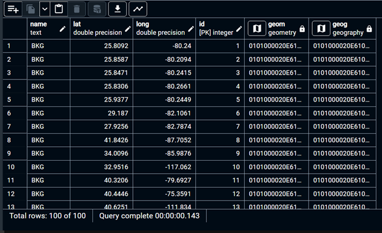
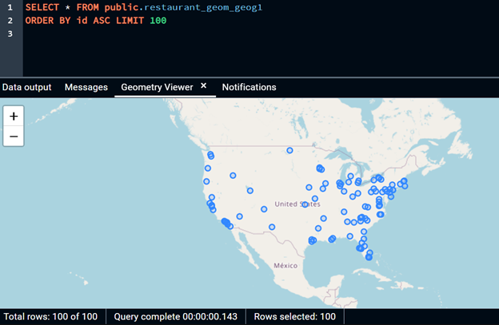

# GTECH785_Fall22

<b>SQL code and screenshots for Lab 3 </b><br>

To add the restaurants.csv file into the database, I used the PGAdmin GUI to create a table, then imported the csv file, as explained in the lecture slides.<br>

SQL Code for Tasks 1 & 2: <br>
```sql
--Adding a primary key to the fastfoodrestaurant table
ALTER TABLE restaurant ADD COLUMN ID SERIAL PRIMARY KEY;

--Copying the fastfoodrestaurant table, to avoid altering any data
CREATE TABLE restaurant_geom_geog1 AS
SELECT  *, ST_Point(long, lat, 4326) geom, ST_Point(long, lat, 4326)::geography geog
FROM restaurant
;

--Resetting the id field as the primary key
ALTER TABLE restaurant_geom_geog1 
ADD PRIMARY KEY (id);
```
<br>Result (I couldn't display all entries on the map, so I am showing 100): <br>





<br>SQL Code for Task 3: <br>
```sql
--Hunter College coordinates: 40.768646, -73.964639
SELECT *, ST_Distance(ST_Point(-73.964639, 40.768646, 4326)::geography, geog) as distance
FROM restaurant_geom_geog1
ORDER BY distance asc
LIMIT 10;
```
<br>Result: <br>

)


