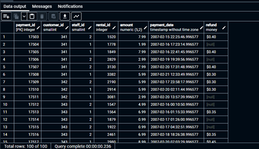
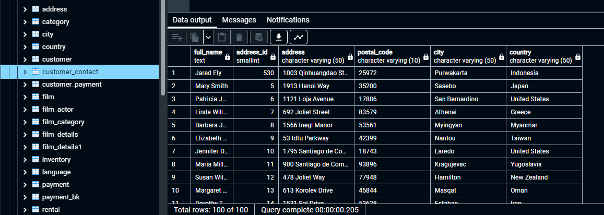
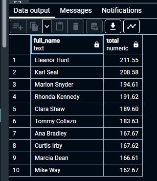

# GTECH785_Fall22

<b>SQL code and screenshots for Lab 3 </b><br>

To add the FastFoodRestaurants.csv file into the database, I used the PGAdmin GUI to create a table, then imported the csv file, as explained in the lecture slides.<br>

SQL Code for Tasks 1 & 2: <br>
```sql
--Adding a primary key to the fastfoodrestaurant table
ALTER TABLE fastfoodrestaurants ADD COLUMN ID SERIAL PRIMARY KEY;

--Copying the fastfoodrestaurant table, to avoid altering any data
CREATE TABLE ffrestaurant_geom_geog AS
SELECT  *, ST_Point(longitude, latitude, 4326) geom, ST_Point(longitude, latitude, 4326)::geography geog
FROM fastfoodrestaurants
;

--Resetting the id field as the primary key
ALTER TABLE ffrestaurant_geom_geog 
ADD PRIMARY KEY (id);
```
<br>Result: <br>


<br>SQL Code for Question 2: <br>
```sql
ALTER TABLE payment 
ADD COLUMN refund money;
UPDATE payment
SET refund = amount * .05
WHERE amount > 5.00;
```
<br>Result: <br>



<br> SQL Code for Question 3: <br>
```sql
ALTER TABLE payment
ADD COLUMN is_refunded boolean;
UPDATE payment
SET is_refunded = TRUE
WHERE refund IS NOT NULL
UPDATE payment
SET is_refunded = FALSE
WHERE refund IS NULL;

CREATE VIEW payment_1 AS 
SELECT * FROM payment;
```
<br>Result: <br>


<br> SQL Code for Question 4: <br>
```sql
CREATE TABLE customer_contact AS
SELECT first_name || ' ' || last_name as full_name, customer.address_id, address.address, address.postal_code, city.city, country.country
FROM customer
LEFT JOIN address ON address.address_id = customer.address_id
LEFT JOIN city ON address.city_id = city.city_id
LEFT JOIN country ON city.country_id = country.country_id ;
```
<br>Result: <br>



<br> SQL Code for Question 5: <br>
```sql
CREATE TABLE customer_payment AS
SELECT first_name || ' ' || last_name as full_name, payment.amount
FROM customer
LEFT JOIN payment ON customer.customer_id = payment.customer_id;

SELECT full_name, sum(amount) total
FROM customer_payment
GROUP BY full_name
ORDER BY total desc
LIMIT 10;
```
<br>Result: <br>



