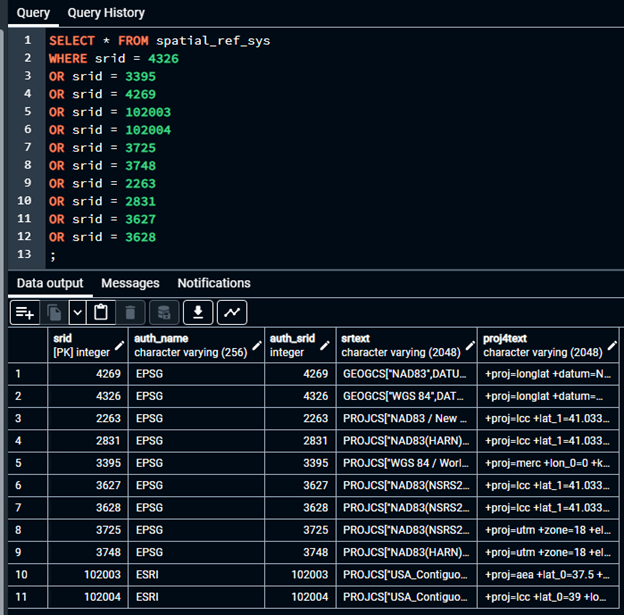
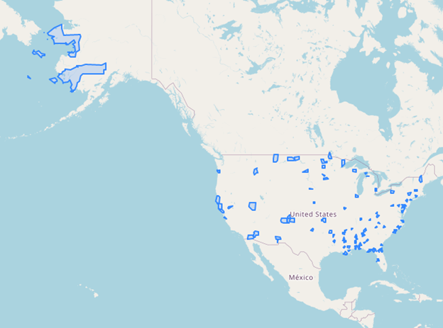
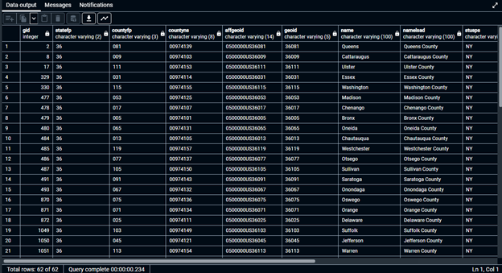

# GTECH785_Fall22

<b>SQL code and screenshots for Lab 4 </b><br>

Table from Task 1, SRID Lookup:<br>

<table>
 <tr style='mso-yfti-irow:0;mso-yfti-firstrow:yes;height:26.95pt'>
  <td width=105 valign=top style='width:78.65pt;border:solid windowtext 1.0pt;
  mso-border-alt:solid windowtext .5pt;padding:0in 5.4pt 0in 5.4pt;height:26.95pt'>
  <p class=MsoNormal><b style='mso-bidi-font-weight:normal'><span
  style='mso-fareast-language:ZH-TW'>SRID in <span class=SpellE>PostGIS</span><i
  style='mso-bidi-font-style:normal'><o:p></o:p></i></span></b></p>
  </td>
  <td width=148 valign=top style='width:110.85pt;border:solid windowtext 1.0pt;
  border-left:none;mso-border-left-alt:solid windowtext .5pt;mso-border-alt:
  solid windowtext .5pt;padding:0in 5.4pt 0in 5.4pt;height:26.95pt'>
  <p class=MsoNormal><b style='mso-bidi-font-weight:normal'><span
  style='mso-fareast-language:ZH-TW'>Spatial Reference System Name<o:p></o:p></span></b></p>
  </td>
  <td width=74 valign=top style='width:55.3pt;border:solid windowtext 1.0pt;
  border-left:none;mso-border-left-alt:solid windowtext .5pt;mso-border-alt:
  solid windowtext .5pt;padding:0in 5.4pt 0in 5.4pt;height:26.95pt'>
  <p class=MsoNormal><b style='mso-bidi-font-weight:normal'><span
  style='mso-fareast-language:ZH-TW'>Datum Used<o:p></o:p></span></b></p>
  </td>
  <td width=77 valign=top style='width:58.0pt;border:solid windowtext 1.0pt;
  border-left:none;mso-border-left-alt:solid windowtext .5pt;mso-border-alt:
  solid windowtext .5pt;padding:0in 5.4pt 0in 5.4pt;height:26.95pt'>
  <p class=MsoNormal><b style='mso-bidi-font-weight:normal'><span
  style='mso-fareast-language:ZH-TW'>Distance Unit<o:p></o:p></span></b></p>
  </td>
  <td width=92 valign=top style='width:69.1pt;border:solid windowtext 1.0pt;
  border-left:none;mso-border-left-alt:solid windowtext .5pt;mso-border-alt:
  solid windowtext .5pt;padding:0in 5.4pt 0in 5.4pt;height:26.95pt'>
  <p class=MsoNormal><b style='mso-bidi-font-weight:normal'><span
  style='mso-fareast-language:ZH-TW'>Projection <o:p></o:p></span></b></p>
  </td>
  <td width=127 valign=top style='width:95.6pt;border:solid windowtext 1.0pt;
  border-left:none;mso-border-left-alt:solid windowtext .5pt;mso-border-alt:
  solid windowtext .5pt;padding:0in 5.4pt 0in 5.4pt;height:26.95pt'>
  <p class=MsoNormal><b style='mso-bidi-font-weight:normal'><span
  style='mso-fareast-language:ZH-TW'>Applicable Regions/Areas<o:p></o:p></span></b></p>
  </td>
 </tr>
 <tr style='mso-yfti-irow:1'>
  <td width=105 valign=top style='width:78.65pt;border:solid windowtext 1.0pt;
  border-top:none;mso-border-top-alt:solid windowtext .5pt;mso-border-alt:solid windowtext .5pt;
  padding:0in 5.4pt 0in 5.4pt'>
  <p class=MsoNormal><span style='mso-fareast-language:ZH-TW'>4326<o:p></o:p></span></p>
  </td>
  <td width=148 valign=top style='width:110.85pt;border-top:none;border-left:
  none;border-bottom:solid windowtext 1.0pt;border-right:solid windowtext 1.0pt;
  mso-border-top-alt:solid windowtext .5pt;mso-border-left-alt:solid windowtext .5pt;
  mso-border-alt:solid windowtext .5pt;padding:0in 5.4pt 0in 5.4pt'>
  <p class=MsoNormal><span style='mso-fareast-language:ZH-TW'>WGS 1984<o:p></o:p></span></p>
  </td>
  <td width=74 valign=top style='width:55.3pt;border-top:none;border-left:none;
  border-bottom:solid windowtext 1.0pt;border-right:solid windowtext 1.0pt;
  mso-border-top-alt:solid windowtext .5pt;mso-border-left-alt:solid windowtext .5pt;
  mso-border-alt:solid windowtext .5pt;padding:0in 5.4pt 0in 5.4pt'>
  <p class=MsoNormal><span style='mso-fareast-language:ZH-TW'>WGS 84<o:p></o:p></span></p>
  </td>
  <td width=77 valign=top style='width:58.0pt;border-top:none;border-left:none;
  border-bottom:solid windowtext 1.0pt;border-right:solid windowtext 1.0pt;
  mso-border-top-alt:solid windowtext .5pt;mso-border-left-alt:solid windowtext .5pt;
  mso-border-alt:solid windowtext .5pt;padding:0in 5.4pt 0in 5.4pt'>
  <p class=MsoNormal><span style='mso-fareast-language:ZH-TW'>Degree<o:p></o:p></span></p>
  </td>
  <td width=92 valign=top style='width:69.1pt;border-top:none;border-left:none;
  border-bottom:solid windowtext 1.0pt;border-right:solid windowtext 1.0pt;
  mso-border-top-alt:solid windowtext .5pt;mso-border-left-alt:solid windowtext .5pt;
  mso-border-alt:solid windowtext .5pt;padding:0in 5.4pt 0in 5.4pt'>
  <p class=MsoNormal><span style='mso-fareast-language:ZH-TW'>Geographic
  coordinate system<o:p></o:p></span></p>
  </td>
  <td width=127 valign=top style='width:95.6pt;border-top:none;border-left:
  none;border-bottom:solid windowtext 1.0pt;border-right:solid windowtext 1.0pt;
  mso-border-top-alt:solid windowtext .5pt;mso-border-left-alt:solid windowtext .5pt;
  mso-border-alt:solid windowtext .5pt;padding:0in 5.4pt 0in 5.4pt'>
  <p class=MsoNormal><span style='mso-fareast-language:ZH-TW'>World<o:p></o:p></span></p>
  </td>
 </tr>
 <tr style='mso-yfti-irow:2'>
  <td width=105 valign=top style='width:78.65pt;border:solid windowtext 1.0pt;
  border-top:none;mso-border-top-alt:solid windowtext .5pt;mso-border-alt:solid windowtext .5pt;
  padding:0in 5.4pt 0in 5.4pt'>
  <p class=MsoNormal><span style='mso-fareast-language:ZH-TW'>3395<o:p></o:p></span></p>
  </td>
  <td width=148 valign=top style='width:110.85pt;border-top:none;border-left:
  none;border-bottom:solid windowtext 1.0pt;border-right:solid windowtext 1.0pt;
  mso-border-top-alt:solid windowtext .5pt;mso-border-left-alt:solid windowtext .5pt;
  mso-border-alt:solid windowtext .5pt;padding:0in 5.4pt 0in 5.4pt'>
  <p class=MsoNormal><span style='mso-fareast-language:ZH-TW'>World Mercator<o:p></o:p></span></p>
  </td>
  <td width=74 valign=top style='width:55.3pt;border-top:none;border-left:none;
  border-bottom:solid windowtext 1.0pt;border-right:solid windowtext 1.0pt;
  mso-border-top-alt:solid windowtext .5pt;mso-border-left-alt:solid windowtext .5pt;
  mso-border-alt:solid windowtext .5pt;padding:0in 5.4pt 0in 5.4pt'>
  <p class=MsoNormal><span style='mso-fareast-language:ZH-TW'>WGS 84<o:p></o:p></span></p>
  </td>
  <td width=77 valign=top style='width:58.0pt;border-top:none;border-left:none;
  border-bottom:solid windowtext 1.0pt;border-right:solid windowtext 1.0pt;
  mso-border-top-alt:solid windowtext .5pt;mso-border-left-alt:solid windowtext .5pt;
  mso-border-alt:solid windowtext .5pt;padding:0in 5.4pt 0in 5.4pt'>
  <p class=MsoNormal><span style='mso-fareast-language:ZH-TW'>Degree<o:p></o:p></span></p>
  </td>
  <td width=92 valign=top style='width:69.1pt;border-top:none;border-left:none;
  border-bottom:solid windowtext 1.0pt;border-right:solid windowtext 1.0pt;
  mso-border-top-alt:solid windowtext .5pt;mso-border-left-alt:solid windowtext .5pt;
  mso-border-alt:solid windowtext .5pt;padding:0in 5.4pt 0in 5.4pt'>
  <p class=MsoNormal><span style='mso-fareast-language:ZH-TW'>Mercator 1SP<o:p></o:p></span></p>
  </td>
  <td width=127 valign=top style='width:95.6pt;border-top:none;border-left:
  none;border-bottom:solid windowtext 1.0pt;border-right:solid windowtext 1.0pt;
  mso-border-top-alt:solid windowtext .5pt;mso-border-left-alt:solid windowtext .5pt;
  mso-border-alt:solid windowtext .5pt;padding:0in 5.4pt 0in 5.4pt'>
  <p class=MsoNormal><span style='mso-fareast-language:ZH-TW'>World - between
  80°S and 84°N<o:p></o:p></span></p>
  </td>
 </tr>
 <tr style='mso-yfti-irow:3'>
  <td width=105 valign=top style='width:78.65pt;border:solid windowtext 1.0pt;
  border-top:none;mso-border-top-alt:solid windowtext .5pt;mso-border-alt:solid windowtext .5pt;
  padding:0in 5.4pt 0in 5.4pt'>
  <p class=MsoNormal><span style='mso-fareast-language:ZH-TW'>4269<o:p></o:p></span></p>
  </td>
  <td width=148 valign=top style='width:110.85pt;border-top:none;border-left:
  none;border-bottom:solid windowtext 1.0pt;border-right:solid windowtext 1.0pt;
  mso-border-top-alt:solid windowtext .5pt;mso-border-left-alt:solid windowtext .5pt;
  mso-border-alt:solid windowtext .5pt;padding:0in 5.4pt 0in 5.4pt'>
  <p class=MsoNormal><span style='mso-fareast-language:ZH-TW'>NAD 83<o:p></o:p></span></p>
  </td>
  <td width=74 valign=top style='width:55.3pt;border-top:none;border-left:none;
  border-bottom:solid windowtext 1.0pt;border-right:solid windowtext 1.0pt;
  mso-border-top-alt:solid windowtext .5pt;mso-border-left-alt:solid windowtext .5pt;
  mso-border-alt:solid windowtext .5pt;padding:0in 5.4pt 0in 5.4pt'>
  <p class=MsoNormal><span style='mso-fareast-language:ZH-TW'>NAD 83<o:p></o:p></span></p>
  </td>
  <td width=77 valign=top style='width:58.0pt;border-top:none;border-left:none;
  border-bottom:solid windowtext 1.0pt;border-right:solid windowtext 1.0pt;
  mso-border-top-alt:solid windowtext .5pt;mso-border-left-alt:solid windowtext .5pt;
  mso-border-alt:solid windowtext .5pt;padding:0in 5.4pt 0in 5.4pt'>
  <p class=MsoNormal><span style='mso-fareast-language:ZH-TW'>Degree<o:p></o:p></span></p>
  </td>
  <td width=92 valign=top style='width:69.1pt;border-top:none;border-left:none;
  border-bottom:solid windowtext 1.0pt;border-right:solid windowtext 1.0pt;
  mso-border-top-alt:solid windowtext .5pt;mso-border-left-alt:solid windowtext .5pt;
  mso-border-alt:solid windowtext .5pt;padding:0in 5.4pt 0in 5.4pt'>
  <p class=MsoNormal><span style='mso-fareast-language:ZH-TW'>Geographic
  coordinate system<o:p></o:p></span></p>
  </td>
  <td width=127 valign=top style='width:95.6pt;border-top:none;border-left:
  none;border-bottom:solid windowtext 1.0pt;border-right:solid windowtext 1.0pt;
  mso-border-top-alt:solid windowtext .5pt;mso-border-left-alt:solid windowtext .5pt;
  mso-border-alt:solid windowtext .5pt;padding:0in 5.4pt 0in 5.4pt'>
  <p class=MsoNormal><span style='mso-fareast-language:ZH-TW'>North America<o:p></o:p></span></p>
  </td>
 </tr>
 <tr style='mso-yfti-irow:4'>
  <td width=105 valign=top style='width:78.65pt;border:solid windowtext 1.0pt;
  border-top:none;mso-border-top-alt:solid windowtext .5pt;mso-border-alt:solid windowtext .5pt;
  padding:0in 5.4pt 0in 5.4pt'>
  <p class=MsoNormal><span style='mso-fareast-language:ZH-TW'>ESRI:102003<o:p></o:p></span></p>
  </td>
  <td width=148 valign=top style='width:110.85pt;border-top:none;border-left:
  none;border-bottom:solid windowtext 1.0pt;border-right:solid windowtext 1.0pt;
  mso-border-top-alt:solid windowtext .5pt;mso-border-left-alt:solid windowtext .5pt;
  mso-border-alt:solid windowtext .5pt;padding:0in 5.4pt 0in 5.4pt'>
  <p class=MsoNormal><span style='mso-fareast-language:ZH-TW'>Albers for
  Contiguous US <o:p></o:p></span></p>
  </td>
  <td width=74 valign=top style='width:55.3pt;border-top:none;border-left:none;
  border-bottom:solid windowtext 1.0pt;border-right:solid windowtext 1.0pt;
  mso-border-top-alt:solid windowtext .5pt;mso-border-left-alt:solid windowtext .5pt;
  mso-border-alt:solid windowtext .5pt;padding:0in 5.4pt 0in 5.4pt'>
  <p class=MsoNormal><span style='mso-fareast-language:ZH-TW'>NAD 83<o:p></o:p></span></p>
  </td>
  <td width=77 valign=top style='width:58.0pt;border-top:none;border-left:none;
  border-bottom:solid windowtext 1.0pt;border-right:solid windowtext 1.0pt;
  mso-border-top-alt:solid windowtext .5pt;mso-border-left-alt:solid windowtext .5pt;
  mso-border-alt:solid windowtext .5pt;padding:0in 5.4pt 0in 5.4pt'>
  <p class=MsoNormal><span style='mso-fareast-language:ZH-TW'>Degree<o:p></o:p></span></p>
  </td>
  <td width=92 valign=top style='width:69.1pt;border-top:none;border-left:none;
  border-bottom:solid windowtext 1.0pt;border-right:solid windowtext 1.0pt;
  mso-border-top-alt:solid windowtext .5pt;mso-border-left-alt:solid windowtext .5pt;
  mso-border-alt:solid windowtext .5pt;padding:0in 5.4pt 0in 5.4pt'>
  <p class=MsoNormal><span style='mso-fareast-language:ZH-TW'>Albers Conic
  Equal Area<o:p></o:p></span></p>
  </td>
  <td width=127 valign=top style='width:95.6pt;border-top:none;border-left:
  none;border-bottom:solid windowtext 1.0pt;border-right:solid windowtext 1.0pt;
  mso-border-top-alt:solid windowtext .5pt;mso-border-left-alt:solid windowtext .5pt;
  mso-border-alt:solid windowtext .5pt;padding:0in 5.4pt 0in 5.4pt'>
  <p class=MsoNormal><span style='mso-fareast-language:ZH-TW'>Contiguous USA<o:p></o:p></span></p>
  </td>
 </tr>
 <tr style='mso-yfti-irow:5'>
  <td width=105 valign=top style='width:78.65pt;border:solid windowtext 1.0pt;
  border-top:none;mso-border-top-alt:solid windowtext .5pt;mso-border-alt:solid windowtext .5pt;
  padding:0in 5.4pt 0in 5.4pt'>
  <p class=MsoNormal><span style='mso-fareast-language:ZH-TW'>ESRI:102004<o:p></o:p></span></p>
  </td>
  <td width=148 valign=top style='width:110.85pt;border-top:none;border-left:
  none;border-bottom:solid windowtext 1.0pt;border-right:solid windowtext 1.0pt;
  mso-border-top-alt:solid windowtext .5pt;mso-border-left-alt:solid windowtext .5pt;
  mso-border-alt:solid windowtext .5pt;padding:0in 5.4pt 0in 5.4pt'>
  <p class=MsoNormal><span style='mso-fareast-language:ZH-TW'>Lambert for
  Contiguous US <o:p></o:p></span></p>
  </td>
  <td width=74 valign=top style='width:55.3pt;border-top:none;border-left:none;
  border-bottom:solid windowtext 1.0pt;border-right:solid windowtext 1.0pt;
  mso-border-top-alt:solid windowtext .5pt;mso-border-left-alt:solid windowtext .5pt;
  mso-border-alt:solid windowtext .5pt;padding:0in 5.4pt 0in 5.4pt'>
  <p class=MsoNormal><span style='mso-fareast-language:ZH-TW'>NAD 83<o:p></o:p></span></p>
  </td>
  <td width=77 valign=top style='width:58.0pt;border-top:none;border-left:none;
  border-bottom:solid windowtext 1.0pt;border-right:solid windowtext 1.0pt;
  mso-border-top-alt:solid windowtext .5pt;mso-border-left-alt:solid windowtext .5pt;
  mso-border-alt:solid windowtext .5pt;padding:0in 5.4pt 0in 5.4pt'>
  <p class=MsoNormal><span style='mso-fareast-language:ZH-TW'>Degree<o:p></o:p></span></p>
  </td>
  <td width=92 valign=top style='width:69.1pt;border-top:none;border-left:none;
  border-bottom:solid windowtext 1.0pt;border-right:solid windowtext 1.0pt;
  mso-border-top-alt:solid windowtext .5pt;mso-border-left-alt:solid windowtext .5pt;
  mso-border-alt:solid windowtext .5pt;padding:0in 5.4pt 0in 5.4pt'>
  <p class=MsoNormal><span style='mso-fareast-language:ZH-TW'>Lambert Conformal
  Conic<o:p></o:p></span></p>
  </td>
  <td width=127 valign=top style='width:95.6pt;border-top:none;border-left:
  none;border-bottom:solid windowtext 1.0pt;border-right:solid windowtext 1.0pt;
  mso-border-top-alt:solid windowtext .5pt;mso-border-left-alt:solid windowtext .5pt;
  mso-border-alt:solid windowtext .5pt;padding:0in 5.4pt 0in 5.4pt'>
  <p class=MsoNormal><span style='mso-fareast-language:ZH-TW'>Contiguous USA<o:p></o:p></span></p>
  </td>
 </tr>
 <tr style='mso-yfti-irow:6'>
  <td width=105 valign=top style='width:78.65pt;border:solid windowtext 1.0pt;
  border-top:none;mso-border-top-alt:solid windowtext .5pt;mso-border-alt:solid windowtext .5pt;
  padding:0in 5.4pt 0in 5.4pt'>
  <p class=MsoNormal><span style='mso-fareast-language:ZH-TW'>3725 <o:p></o:p></span></p>
  </td>
  <td width=148 valign=top style='width:110.85pt;border-top:none;border-left:
  none;border-bottom:solid windowtext 1.0pt;border-right:solid windowtext 1.0pt;
  mso-border-top-alt:solid windowtext .5pt;mso-border-left-alt:solid windowtext .5pt;
  mso-border-alt:solid windowtext .5pt;padding:0in 5.4pt 0in 5.4pt'>
  <p class=MsoNormal><span style='mso-fareast-language:ZH-TW'>UTM 18N <o:p></o:p></span></p>
  </td>
  <td width=74 valign=top style='width:55.3pt;border-top:none;border-left:none;
  border-bottom:solid windowtext 1.0pt;border-right:solid windowtext 1.0pt;
  mso-border-top-alt:solid windowtext .5pt;mso-border-left-alt:solid windowtext .5pt;
  mso-border-alt:solid windowtext .5pt;padding:0in 5.4pt 0in 5.4pt'>
  <p class=MsoNormal><span style='mso-fareast-language:ZH-TW'>NAD 83 2007<o:p></o:p></span></p>
  </td>
  <td width=77 valign=top style='width:58.0pt;border-top:none;border-left:none;
  border-bottom:solid windowtext 1.0pt;border-right:solid windowtext 1.0pt;
  mso-border-top-alt:solid windowtext .5pt;mso-border-left-alt:solid windowtext .5pt;
  mso-border-alt:solid windowtext .5pt;padding:0in 5.4pt 0in 5.4pt'>
  <p class=MsoNormal><span style='mso-fareast-language:ZH-TW'>Degree<o:p></o:p></span></p>
  </td>
  <td width=92 valign=top style='width:69.1pt;border-top:none;border-left:none;
  border-bottom:solid windowtext 1.0pt;border-right:solid windowtext 1.0pt;
  mso-border-top-alt:solid windowtext .5pt;mso-border-left-alt:solid windowtext .5pt;
  mso-border-alt:solid windowtext .5pt;padding:0in 5.4pt 0in 5.4pt'>
  <p class=MsoNormal><span style='mso-fareast-language:ZH-TW'>Transverse
  Mercator<o:p></o:p></span></p>
  </td>
  <td width=127 valign=top style='width:95.6pt;border-top:none;border-left:
  none;border-bottom:solid windowtext 1.0pt;border-right:solid windowtext 1.0pt;
  mso-border-top-alt:solid windowtext .5pt;mso-border-left-alt:solid windowtext .5pt;
  mso-border-alt:solid windowtext .5pt;padding:0in 5.4pt 0in 5.4pt'>
  <p class=MsoNormal><span style='mso-fareast-language:ZH-TW'>USA, 72W to 78W.
  NY, PA, NJ, CT<o:p></o:p></span></p>
  </td>
 </tr>
 <tr style='mso-yfti-irow:7'>
  <td width=105 valign=top style='width:78.65pt;border:solid windowtext 1.0pt;
  border-top:none;mso-border-top-alt:solid windowtext .5pt;mso-border-alt:solid windowtext .5pt;
  padding:0in 5.4pt 0in 5.4pt'>
  <p class=MsoNormal><span style='mso-fareast-language:ZH-TW'>3748<o:p></o:p></span></p>
  </td>
  <td width=148 valign=top style='width:110.85pt;border-top:none;border-left:
  none;border-bottom:solid windowtext 1.0pt;border-right:solid windowtext 1.0pt;
  mso-border-top-alt:solid windowtext .5pt;mso-border-left-alt:solid windowtext .5pt;
  mso-border-alt:solid windowtext .5pt;padding:0in 5.4pt 0in 5.4pt'>
  <p class=MsoNormal><span style='mso-fareast-language:ZH-TW'>NAD83(HARN) / UTM
  zone 18N<o:p></o:p></span></p>
  </td>
  <td width=74 valign=top style='width:55.3pt;border-top:none;border-left:none;
  border-bottom:solid windowtext 1.0pt;border-right:solid windowtext 1.0pt;
  mso-border-top-alt:solid windowtext .5pt;mso-border-left-alt:solid windowtext .5pt;
  mso-border-alt:solid windowtext .5pt;padding:0in 5.4pt 0in 5.4pt'>
  <p class=MsoNormal><span style='mso-fareast-language:ZH-TW'>NAD 83 HARN<o:p></o:p></span></p>
  </td>
  <td width=77 valign=top style='width:58.0pt;border-top:none;border-left:none;
  border-bottom:solid windowtext 1.0pt;border-right:solid windowtext 1.0pt;
  mso-border-top-alt:solid windowtext .5pt;mso-border-left-alt:solid windowtext .5pt;
  mso-border-alt:solid windowtext .5pt;padding:0in 5.4pt 0in 5.4pt'>
  <p class=MsoNormal><span style='mso-fareast-language:ZH-TW'>Degree<o:p></o:p></span></p>
  </td>
  <td width=92 valign=top style='width:69.1pt;border-top:none;border-left:none;
  border-bottom:solid windowtext 1.0pt;border-right:solid windowtext 1.0pt;
  mso-border-top-alt:solid windowtext .5pt;mso-border-left-alt:solid windowtext .5pt;
  mso-border-alt:solid windowtext .5pt;padding:0in 5.4pt 0in 5.4pt'>
  <p class=MsoNormal><span style='mso-fareast-language:ZH-TW'>Transverse
  Mercator<o:p></o:p></span></p>
  </td>
  <td width=127 valign=top style='width:95.6pt;border-top:none;border-left:
  none;border-bottom:solid windowtext 1.0pt;border-right:solid windowtext 1.0pt;
  mso-border-top-alt:solid windowtext .5pt;mso-border-left-alt:solid windowtext .5pt;
  mso-border-alt:solid windowtext .5pt;padding:0in 5.4pt 0in 5.4pt'>
  <p class=MsoNormal><span style='mso-fareast-language:ZH-TW'>USA, 72W to 78W.
  NY, PA, NJ, CT<o:p></o:p></span></p>
  </td>
 </tr>
 <tr style='mso-yfti-irow:8'>
  <td width=105 valign=top style='width:78.65pt;border:solid windowtext 1.0pt;
  border-top:none;mso-border-top-alt:solid windowtext .5pt;mso-border-alt:solid windowtext .5pt;
  padding:0in 5.4pt 0in 5.4pt'>
  <p class=MsoNormal><span style='mso-fareast-language:ZH-TW'>2263<o:p></o:p></span></p>
  </td>
  <td width=148 valign=top style='width:110.85pt;border-top:none;border-left:
  none;border-bottom:solid windowtext 1.0pt;border-right:solid windowtext 1.0pt;
  mso-border-top-alt:solid windowtext .5pt;mso-border-left-alt:solid windowtext .5pt;
  mso-border-alt:solid windowtext .5pt;padding:0in 5.4pt 0in 5.4pt'>
  <p class=MsoNormal><span style='mso-fareast-language:ZH-TW'>SPCS Long Island<o:p></o:p></span></p>
  </td>
  <td width=74 valign=top style='width:55.3pt;border-top:none;border-left:none;
  border-bottom:solid windowtext 1.0pt;border-right:solid windowtext 1.0pt;
  mso-border-top-alt:solid windowtext .5pt;mso-border-left-alt:solid windowtext .5pt;
  mso-border-alt:solid windowtext .5pt;padding:0in 5.4pt 0in 5.4pt'>
  <p class=MsoNormal><span style='mso-fareast-language:ZH-TW'>NAD 83<o:p></o:p></span></p>
  </td>
  <td width=77 valign=top style='width:58.0pt;border-top:none;border-left:none;
  border-bottom:solid windowtext 1.0pt;border-right:solid windowtext 1.0pt;
  mso-border-top-alt:solid windowtext .5pt;mso-border-left-alt:solid windowtext .5pt;
  mso-border-alt:solid windowtext .5pt;padding:0in 5.4pt 0in 5.4pt'>
  <p class=MsoNormal><span style='mso-fareast-language:ZH-TW'>US Survey Foot<o:p></o:p></span></p>
  </td>
  <td width=92 valign=top style='width:69.1pt;border-top:none;border-left:none;
  border-bottom:solid windowtext 1.0pt;border-right:solid windowtext 1.0pt;
  mso-border-top-alt:solid windowtext .5pt;mso-border-left-alt:solid windowtext .5pt;
  mso-border-alt:solid windowtext .5pt;padding:0in 5.4pt 0in 5.4pt'>
  <p class=MsoNormal><span style='mso-fareast-language:ZH-TW'>Lambert Conformal
  Conic<o:p></o:p></span></p>
  </td>
  <td width=127 valign=top style='width:95.6pt;border-top:none;border-left:
  none;border-bottom:solid windowtext 1.0pt;border-right:solid windowtext 1.0pt;
  mso-border-top-alt:solid windowtext .5pt;mso-border-left-alt:solid windowtext .5pt;
  mso-border-alt:solid windowtext .5pt;padding:0in 5.4pt 0in 5.4pt'>
  <p class=MsoNormal><span style='mso-fareast-language:ZH-TW'>New York City, <span
  class=GramE>Nassau</span> and Suffolk Counties<o:p></o:p></span></p>
  </td>
 </tr>
 <tr style='mso-yfti-irow:9'>
  <td width=105 valign=top style='width:78.65pt;border:solid windowtext 1.0pt;
  border-top:none;mso-border-top-alt:solid windowtext .5pt;mso-border-alt:solid windowtext .5pt;
  padding:0in 5.4pt 0in 5.4pt'>
  <p class=MsoNormal><span style='mso-fareast-language:ZH-TW'>2831<o:p></o:p></span></p>
  </td>
  <td width=148 valign=top style='width:110.85pt;border-top:none;border-left:
  none;border-bottom:solid windowtext 1.0pt;border-right:solid windowtext 1.0pt;
  mso-border-top-alt:solid windowtext .5pt;mso-border-left-alt:solid windowtext .5pt;
  mso-border-alt:solid windowtext .5pt;padding:0in 5.4pt 0in 5.4pt'>
  <p class=MsoNormal><span style='mso-fareast-language:ZH-TW'>SPCS Long Island<o:p></o:p></span></p>
  </td>
  <td width=74 valign=top style='width:55.3pt;border-top:none;border-left:none;
  border-bottom:solid windowtext 1.0pt;border-right:solid windowtext 1.0pt;
  mso-border-top-alt:solid windowtext .5pt;mso-border-left-alt:solid windowtext .5pt;
  mso-border-alt:solid windowtext .5pt;padding:0in 5.4pt 0in 5.4pt'>
  <p class=MsoNormal><span style='mso-fareast-language:ZH-TW'>NAD 83 HARN<o:p></o:p></span></p>
  </td>
  <td width=77 valign=top style='width:58.0pt;border-top:none;border-left:none;
  border-bottom:solid windowtext 1.0pt;border-right:solid windowtext 1.0pt;
  mso-border-top-alt:solid windowtext .5pt;mso-border-left-alt:solid windowtext .5pt;
  mso-border-alt:solid windowtext .5pt;padding:0in 5.4pt 0in 5.4pt'>
  <p class=MsoNormal><span style='mso-fareast-language:ZH-TW'>Meter<o:p></o:p></span></p>
  </td>
  <td width=92 valign=top style='width:69.1pt;border-top:none;border-left:none;
  border-bottom:solid windowtext 1.0pt;border-right:solid windowtext 1.0pt;
  mso-border-top-alt:solid windowtext .5pt;mso-border-left-alt:solid windowtext .5pt;
  mso-border-alt:solid windowtext .5pt;padding:0in 5.4pt 0in 5.4pt'>
  <p class=MsoNormal><span style='mso-fareast-language:ZH-TW'>Lambert Conformal
  Conic<o:p></o:p></span></p>
  </td>
  <td width=127 valign=top style='width:95.6pt;border-top:none;border-left:
  none;border-bottom:solid windowtext 1.0pt;border-right:solid windowtext 1.0pt;
  mso-border-top-alt:solid windowtext .5pt;mso-border-left-alt:solid windowtext .5pt;
  mso-border-alt:solid windowtext .5pt;padding:0in 5.4pt 0in 5.4pt'>
  <p class=MsoNormal><span style='mso-fareast-language:ZH-TW'>New York City, <span
  class=GramE>Nassau</span> and Suffolk Counties<o:p></o:p></span></p>
  </td>
 </tr>
 <tr style='mso-yfti-irow:10'>
  <td width=105 valign=top style='width:78.65pt;border:solid windowtext 1.0pt;
  border-top:none;mso-border-top-alt:solid windowtext .5pt;mso-border-alt:solid windowtext .5pt;
  padding:0in 5.4pt 0in 5.4pt'>
  <p class=MsoNormal><span style='mso-fareast-language:ZH-TW'>3627<o:p></o:p></span></p>
  </td>
  <td width=148 valign=top style='width:110.85pt;border-top:none;border-left:
  none;border-bottom:solid windowtext 1.0pt;border-right:solid windowtext 1.0pt;
  mso-border-top-alt:solid windowtext .5pt;mso-border-left-alt:solid windowtext .5pt;
  mso-border-alt:solid windowtext .5pt;padding:0in 5.4pt 0in 5.4pt'>
  <p class=MsoNormal><span style='mso-fareast-language:ZH-TW'>SPCS Long Island<o:p></o:p></span></p>
  </td>
  <td width=74 valign=top style='width:55.3pt;border-top:none;border-left:none;
  border-bottom:solid windowtext 1.0pt;border-right:solid windowtext 1.0pt;
  mso-border-top-alt:solid windowtext .5pt;mso-border-left-alt:solid windowtext .5pt;
  mso-border-alt:solid windowtext .5pt;padding:0in 5.4pt 0in 5.4pt'>
  <p class=MsoNormal><span style='mso-fareast-language:ZH-TW'>NAD 83 NSRS 2007<o:p></o:p></span></p>
  </td>
  <td width=77 valign=top style='width:58.0pt;border-top:none;border-left:none;
  border-bottom:solid windowtext 1.0pt;border-right:solid windowtext 1.0pt;
  mso-border-top-alt:solid windowtext .5pt;mso-border-left-alt:solid windowtext .5pt;
  mso-border-alt:solid windowtext .5pt;padding:0in 5.4pt 0in 5.4pt'>
  <p class=MsoNormal><span style='mso-fareast-language:ZH-TW'>Meter<o:p></o:p></span></p>
  </td>
  <td width=92 valign=top style='width:69.1pt;border-top:none;border-left:none;
  border-bottom:solid windowtext 1.0pt;border-right:solid windowtext 1.0pt;
  mso-border-top-alt:solid windowtext .5pt;mso-border-left-alt:solid windowtext .5pt;
  mso-border-alt:solid windowtext .5pt;padding:0in 5.4pt 0in 5.4pt'>
  <p class=MsoNormal><span style='mso-fareast-language:ZH-TW'>Lambert Conformal
  Conic<o:p></o:p></span></p>
  </td>
  <td width=127 valign=top style='width:95.6pt;border-top:none;border-left:
  none;border-bottom:solid windowtext 1.0pt;border-right:solid windowtext 1.0pt;
  mso-border-top-alt:solid windowtext .5pt;mso-border-left-alt:solid windowtext .5pt;
  mso-border-alt:solid windowtext .5pt;padding:0in 5.4pt 0in 5.4pt'>
  <p class=MsoNormal><span style='mso-fareast-language:ZH-TW'>New York City, <span
  class=GramE>Nassau</span> and Suffolk Counties<o:p></o:p></span></p>
  </td>
 </tr>
 <tr style='mso-yfti-irow:11;mso-yfti-lastrow:yes'>
  <td width=105 valign=top style='width:78.65pt;border:solid windowtext 1.0pt;
  border-top:none;mso-border-top-alt:solid windowtext .5pt;mso-border-alt:solid windowtext .5pt;
  padding:0in 5.4pt 0in 5.4pt'>
  <p class=MsoNormal><span style='mso-fareast-language:ZH-TW'>3628<o:p></o:p></span></p>
  </td>
  <td width=148 valign=top style='width:110.85pt;border-top:none;border-left:
  none;border-bottom:solid windowtext 1.0pt;border-right:solid windowtext 1.0pt;
  mso-border-top-alt:solid windowtext .5pt;mso-border-left-alt:solid windowtext .5pt;
  mso-border-alt:solid windowtext .5pt;padding:0in 5.4pt 0in 5.4pt'>
  <p class=MsoNormal><span style='mso-fareast-language:ZH-TW'>NAD83(NSRS2007) /
  New York Long Island (<span class=SpellE>ftUS</span>)<o:p></o:p></span></p>
  </td>
  <td width=74 valign=top style='width:55.3pt;border-top:none;border-left:none;
  border-bottom:solid windowtext 1.0pt;border-right:solid windowtext 1.0pt;
  mso-border-top-alt:solid windowtext .5pt;mso-border-left-alt:solid windowtext .5pt;
  mso-border-alt:solid windowtext .5pt;padding:0in 5.4pt 0in 5.4pt'>
  <p class=MsoNormal><span style='mso-fareast-language:ZH-TW'>NAD 83 NSRS 2007<o:p></o:p></span></p>
  </td>
  <td width=77 valign=top style='width:58.0pt;border-top:none;border-left:none;
  border-bottom:solid windowtext 1.0pt;border-right:solid windowtext 1.0pt;
  mso-border-top-alt:solid windowtext .5pt;mso-border-left-alt:solid windowtext .5pt;
  mso-border-alt:solid windowtext .5pt;padding:0in 5.4pt 0in 5.4pt'>
  <p class=MsoNormal><span style='mso-fareast-language:ZH-TW'>US Survey Foot<o:p></o:p></span></p>
  </td>
  <td width=92 valign=top style='width:69.1pt;border-top:none;border-left:none;
  border-bottom:solid windowtext 1.0pt;border-right:solid windowtext 1.0pt;
  mso-border-top-alt:solid windowtext .5pt;mso-border-left-alt:solid windowtext .5pt;
  mso-border-alt:solid windowtext .5pt;padding:0in 5.4pt 0in 5.4pt'>
  <p class=MsoNormal><span style='mso-fareast-language:ZH-TW'>Lambert Conformal
  Conic<o:p></o:p></span></p>
  </td>
  <td width=127 valign=top style='width:95.6pt;border-top:none;border-left:
  none;border-bottom:solid windowtext 1.0pt;border-right:solid windowtext 1.0pt;
  mso-border-top-alt:solid windowtext .5pt;mso-border-left-alt:solid windowtext .5pt;
  mso-border-alt:solid windowtext .5pt;padding:0in 5.4pt 0in 5.4pt'>
  <p class=MsoNormal><span style='mso-fareast-language:ZH-TW'>New York City, <span
  class=GramE>Nassau</span> and Suffolk Counties<o:p></o:p></span></p>
  </td>
 </tr>
</table>

Screenshot of SRIDs in the spatial_ref_sys table:<br>



<br>SQL Code for Question 2.1: <br>
```sql
--Loaded the shapefile into QGIS to check the coordinate system. EPSG 4269, NAD 83
SELECT UpdateGeometrySRID('cb_2020_us_county_500k', 'geom', 4269);

--Changing the CRS to WGS 84 and displaying the basemap.
--PGAdmin crashes when I try to display all records, so I am showing 100.
SELECT ST_Transform(geom, 4326) AS geo_wgs84
FROM cb_2020_us_county_500k
LIMIT 100;
```
Result:<br>


<br>SQL Code for Question 2.2: <br>
```sql
--Creating a table of NY Counties
CREATE TABLE ny_counties AS
SELECT * FROM cb_2020_us_county_500k
WHERE stusps = 'NY';
```

Result:<br>

