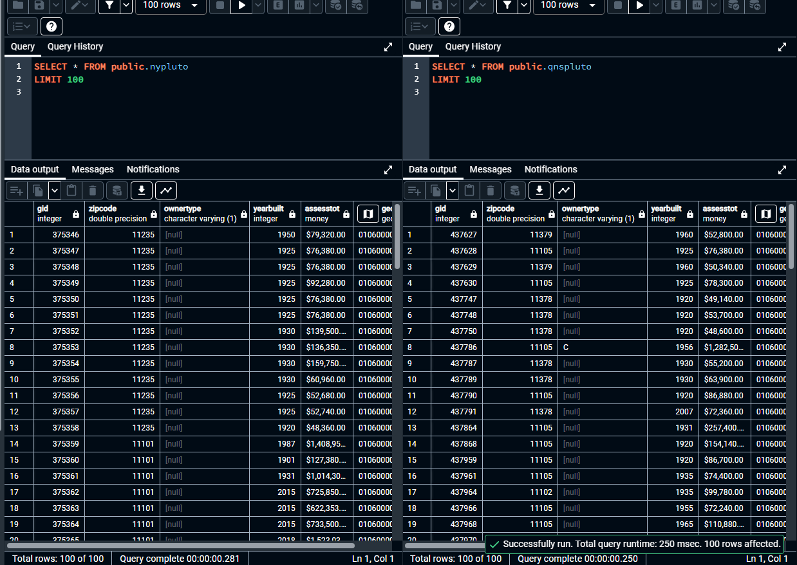
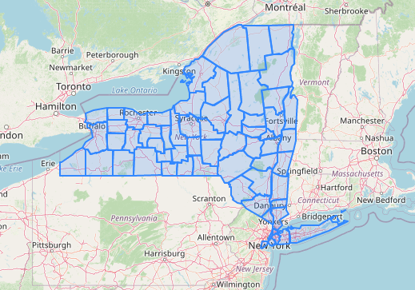
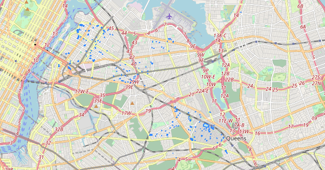
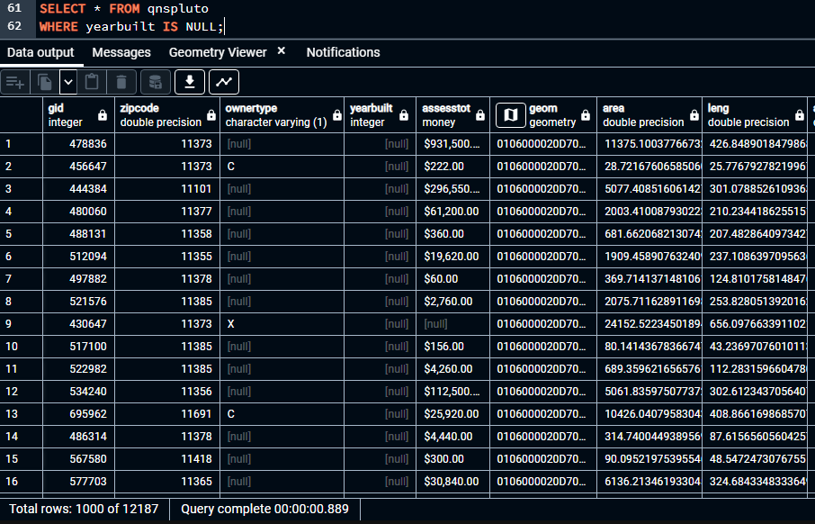
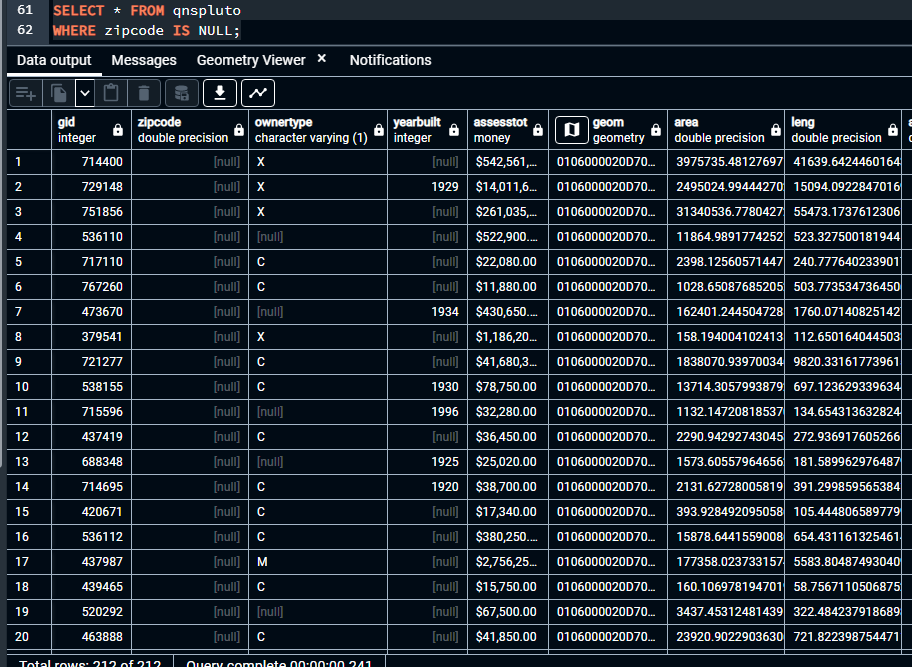
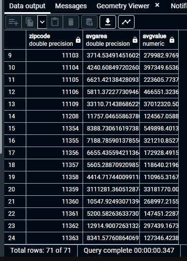
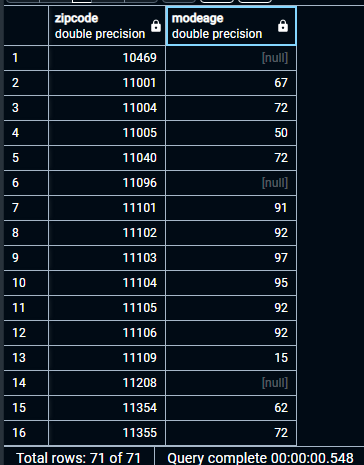
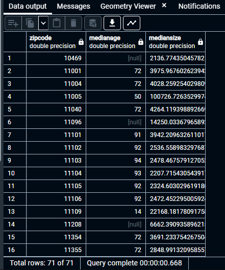

# GTECH785_Fall22

<b>SQL code and screenshots for Lab 5 </b><br>

<br>SQL Code for Task 1: <br>
```sql
--Creating a NY Pluto table
CREATE TABLE nypluto AS 
SELECT gid, zipcode, ownertype, yearbuilt, assesstot::money, geom
FROM mappluto;

--Creating a Queens Pluto table
CREATE TABLE qnspluto AS 
SELECT gid, zipcode, ownertype, yearbuilt, assesstot::money, geom
FROM mappluto
WHERE borough = 'QN';
```
Result:<br>


<br>SQL Code for Task 2: <br>
```sql
--Checking the SRIDs of the geometry columns
SELECT ST_SRID(geom_utm)
FROM ny_counties;
SELECT ST_SRID(geom)
FROM mappluto;

--Displaying the basemaps under the county and pluto data.
SELECT ST_Transform(geom, 4326) 
FROM ny_counties
LIMIT 100;
SELECT ST_Transform(geom, 4326) 
FROM qnspluto
LIMIT 300;

--Creating spatial indicies
CREATE INDEX pluto_geom_id
ON qnspluto
USING GIST (geom);
CREATE INDEX geom_id
ON ny_counties
USING GIST (geom_utm);

--Checking for simple and valid polygons
--All polygons in both shapefiles are simple and valid
SELECT *
FROM qnspluto
WHERE not ST_IsSimple(geom) or not ST_IsValid(geom);
SELECT *
FROM ny_counties
WHERE not ST_IsSimple(geom_utm) or not ST_IsValid(geom_utm);

--Changing the year built value to NULL for buildings listed being built in year 0
UPDATE qnspluto
SET yearbuilt = NULL
WHERE yearbuilt = 0;

--Setting the zipcode as NULL where zipcode = 0
UPDATE qnspluto
SET zipcode = NULL
WHERE zipcode = 0;

--Determining the percentage of properties with invalid zipcode or year built
--About 3.8% of properties had an invalid value for yearbuilt
--About 0.06% of properties had an invalid value for zipcode
SELECT
(SELECT count(*)
FROM qnspluto
WHERE yearbuilt IS NULL)::float/
(SELECT count(*)
FROM qnspluto)::float;
SELECT
(SELECT count(*)
FROM qnspluto
WHERE zipcode IS NULL)::float/
(SELECT count(*)
FROM qnspluto)::float;
```

Results:<br>





<br>SQL Code for Task 3: <br>
```sql
--Calculating the size, perimeter, and age of each property
--SRID is Long Island State Plane (Feet), so the area will be in square feet & perimeter will be in feet
ALTER TABLE qnspluto 
ADD COLUMN area FLOAT;
ALTER TABLE qnspluto 
ADD COLUMN leng FLOAT;
ALTER TABLE qnspluto 
ADD COLUMN age FLOAT;
UPDATE qnspluto
SET area = ST_Area(geom);
UPDATE qnspluto
SET leng = ST_Perimeter(geom);
UPDATE qnspluto
SET age = (2022-yearbuilt);

--Calculating mean area and assessment by zip code
SELECT zipcode, AVG(area) as avgarea, AVG(assesstot::numeric) as avgvalue
FROM qnspluto
GROUP BY zipcode;

--Calculating the mode of property ages
SELECT zipcode, MODE() within GROUP(order by qnspluto.age) as modeage
FROM qnspluto
GROUP BY zipcode;

--Calculating the median property size and median age by zipcode
SELECT zipcode, percentile_disc(0.5) within GROUP (order by qnspluto.age) as medianage,
percentile_disc(0.5) within GROUP (order by qnspluto.area) as mediansize
FROM qnspluto
GROUP BY zipcode;

--Simplifying the NY county boundaries without preserving topology, with a tolerance of 200 meters
SELECT ST_Simplify(geom_utm, 200)
FROM ny_counties;
```

Results:<br>





