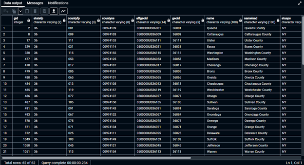

# GTECH785_Fall22

<b>SQL code and screenshots for Lab 5 </b><br>

<br>SQL Code for Task 1: <br>
```sql
--Creating a NY Pluto table
CREATE TABLE nypluto AS 
SELECT gid, zipcode, ownertype, yearbuilt, assesstot::money, geom
FROM mappluto;

--Creating a Queens Pluto table
CREATE TABLE qnspluto AS 
SELECT gid, zipcode, ownertype, yearbuilt, assesstot::money, geom
FROM mappluto
WHERE borough = 'QN';
```
Result:<br>


<br>SQL Code for Question 2.2: <br>
```sql
--Creating a table of NY Counties
CREATE TABLE ny_counties AS
SELECT * FROM cb_2020_us_county_500k
WHERE stusps = 'NY';
```

Result:<br>


<br>SQL Code for Question 2.3: <br>
```sql
--Adding a geometry column to the NY Counties shapefile
ALTER TABLE ny_counties 
ADD COLUMN geom_utm geometry;

--Setting the new geometry column to UTM Zone 18N
UPDATE ny_counties
SET geom_utm = ST_Transform(geom, 3725);

--Confirming that the new column is in UTM Zone 18N
SELECT ST_SRID(geom_utm)
FROM ny_counties;

--Projecting on the fly to WGS 84 to view the basemap and verify the data
SELECT *, ST_Transform(geom_utm, 4326) AS temp_geom_wgs
FROM ny_counties;

```

Result:<br>


<br>SQL Code for Question 2.4: <br>
```sql
--Creating a spatial index for the NY Counties shapefile
CREATE INDEX ny_geom_id
ON ny_counties
USING GIST (geom_utm);
```

Result:<br>

