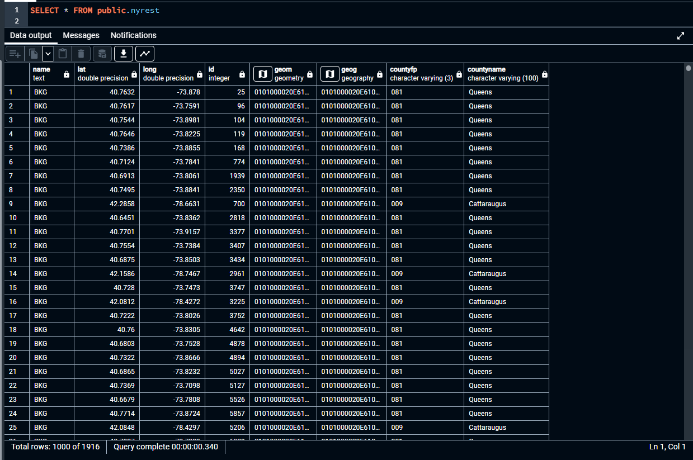
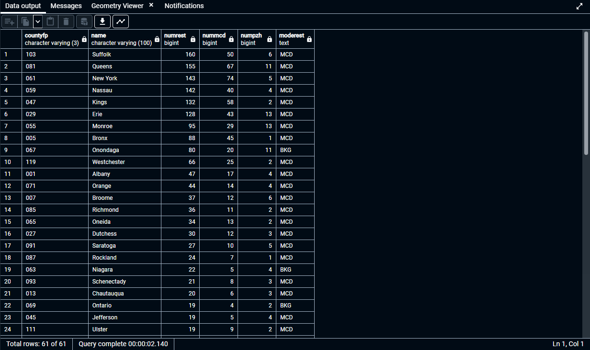

# GTECH785_Fall22

<b>SQL code and screenshots for Lab 6 </b><br>

<br>SQL Code for Task 1: <br>
```sql
--Finding all restaurants in NY state
CREATE VIEW nys_county_v AS
SELECT *
FROM cb_2020_us_county_500k
WHERE statefp = '36';

CREATE TABLE nyrest AS
SELECT r.*, nys.countyfp, nys.name as countyname
FROM restaurant_geom_geog1 as r 
JOIN nys_county_v as nys
ON ST_Contains(ST_Transform(nys.geom, 4326), r.geom);

--Determining how many total restaurants, McDonalds, Pizza Huts are in each county, and the most common restaurant in each county
SELECT nys.countyfp, nys.name, count(*) as numrest, sum((r.name ='MCD')::integer) as nummcd,
sum((r.name ='PZH')::integer) as numpzh,
MODE() within GROUP(order by r.name) as moderest
FROM nys_county_v as nys
JOIN restaurant_geom_geog1 as r
ON ST_Contains(nys.geom, ST_Transform(r.geom, 4269))
GROUP BY nys.countyfp, nys.name
ORDER BY numrest DESC;
```
Results:<br>




<br>SQL Code for Task 2: <br>
```sql
--Creating a table of NYC restaurants
CREATE TABLE nycrest AS
SELECT * FROM nyrest WHERE
countyname = 'Queens' OR
countyname = 'Kings' OR
countyname = 'Richmond' OR
countyname = 'Bronx' OR
countyname = 'New York';

--Finding the total restaurants within 200 meters of each McDonald's in NYC
WITH
mcd AS (SELECT *
FROM nycrest
WHERE name = 'MCD')
SELECT mcd.name, mcd.geom, count(*)-1 as mcd_200
FROM mcd 
JOIN nycrest as rt
ON ST_DWithin(ST_Transform(mcd.geom, 2831), ST_Transform(rt.geom, 2831), 200)
GROUP BY mcd.geom, mcd.name
ORDER BY mcd_200 DESC;

--Finding the total restaurants within 500 meters of each McDonald's in NYC
WITH
mcd AS (SELECT *
FROM nycrest
WHERE name = 'MCD')
SELECT mcd.name, mcd.geom, count(*)-1 as mcd_500
FROM mcd 
JOIN nycrest as rt
ON ST_DWithin(ST_Transform(mcd.geom, 2831), ST_Transform(rt.geom, 2831), 500)
GROUP BY mcd.geom, mcd.name
ORDER BY mcd_500 DESC;

--Finding the total restaurants within 1000 meters of each McDonald's in NYC
WITH
mcd AS (SELECT *
FROM nycrest
WHERE name = 'MCD')
SELECT mcd.name, mcd.geom, count(*)-1 as mcd_1000
FROM mcd 
JOIN nycrest as rt
ON ST_DWithin(ST_Transform(mcd.geom, 2831), ST_Transform(rt.geom, 2831), 1000)
GROUP BY mcd.geom, mcd.name
ORDER BY mcd_1000 DESC;

```

Results:<br>


