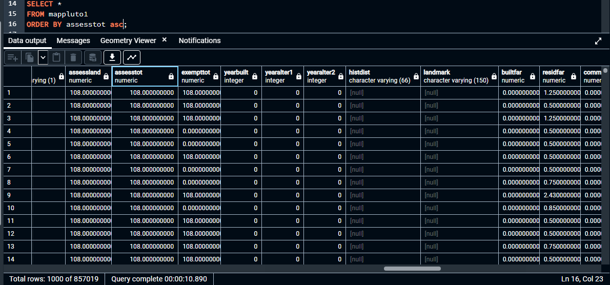
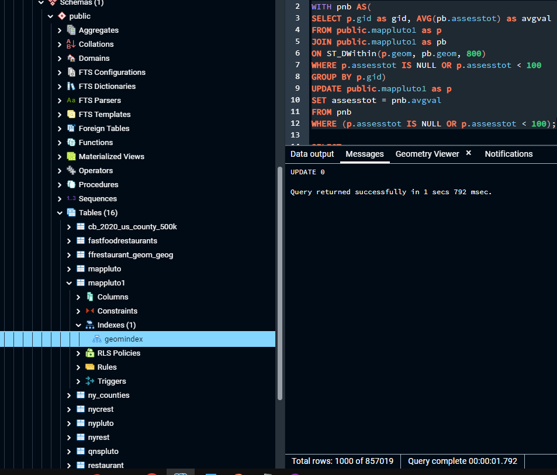
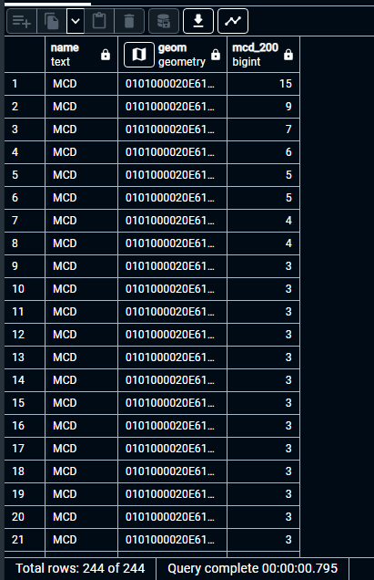
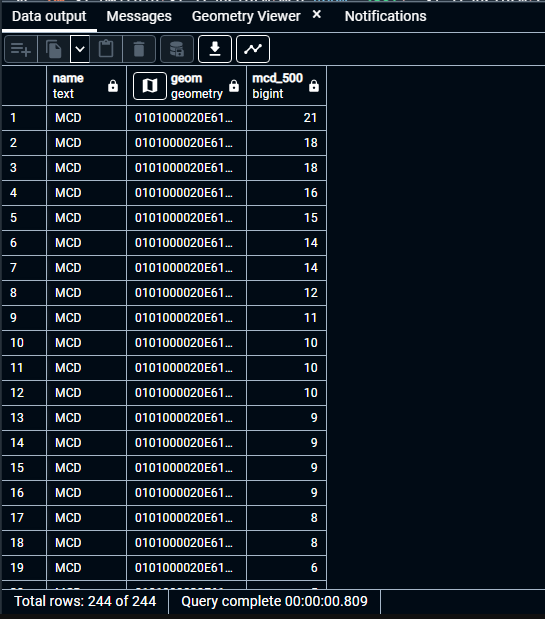
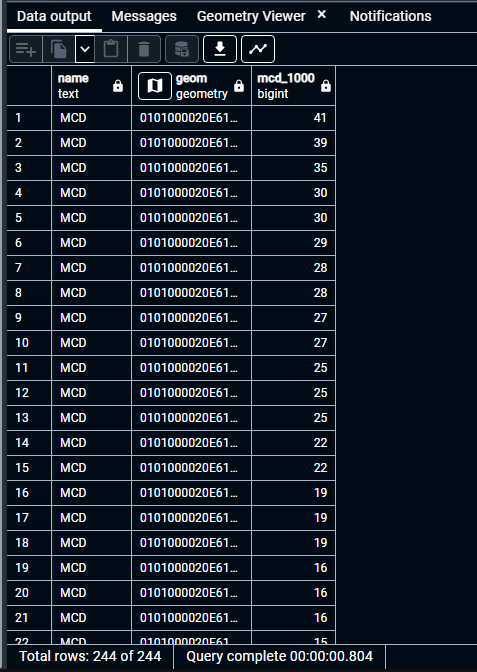

# GTECH785_Fall22

<b>SQL code and screenshots for Lab 7 </b><br>

<br>SQL Code for Task 1: <br>
```sql
--Updating asses values that are NULL of less than $1000 to the average value of the properties within 1000 meters
WITH pnb AS(
SELECT p.gid as gid, AVG(pb.assesstot) as avgval
FROM public.mappluto1 as p
JOIN public.mappluto1 as pb
ON ST_DWithin(p.geom, pb.geom, 800)
WHERE p.assesstot IS NULL OR p.assesstot < 100
GROUP BY p.gid)
UPDATE public.mappluto1 as p
SET assesstot = pnb.avgval
FROM pnb
WHERE (p.assesstot IS NULL OR p.assesstot < 100);
```
Results:<br>




<br>SQL Code for Task 2: <br>
```sql
--Creating a table of NYC restaurants
CREATE TABLE nycrest AS
SELECT * FROM nyrest WHERE
countyname = 'Queens' OR
countyname = 'Kings' OR
countyname = 'Richmond' OR
countyname = 'Bronx' OR
countyname = 'New York';

--Finding the total restaurants within 200 meters of each McDonald's in NYC
WITH
mcd AS (SELECT *
FROM nycrest
WHERE name = 'MCD')
SELECT mcd.name, mcd.geom, count(*)-1 as mcd_200
FROM mcd 
JOIN nycrest as rt
ON ST_DWithin(ST_Transform(mcd.geom, 2831), ST_Transform(rt.geom, 2831), 200)
GROUP BY mcd.geom, mcd.name
ORDER BY mcd_200 DESC;

--Finding the total restaurants within 500 meters of each McDonald's in NYC
WITH
mcd AS (SELECT *
FROM nycrest
WHERE name = 'MCD')
SELECT mcd.name, mcd.geom, count(*)-1 as mcd_500
FROM mcd 
JOIN nycrest as rt
ON ST_DWithin(ST_Transform(mcd.geom, 2831), ST_Transform(rt.geom, 2831), 500)
GROUP BY mcd.geom, mcd.name
ORDER BY mcd_500 DESC;

--Finding the total restaurants within 1000 meters of each McDonald's in NYC
WITH
mcd AS (SELECT *
FROM nycrest
WHERE name = 'MCD')
SELECT mcd.name, mcd.geom, count(*)-1 as mcd_1000
FROM mcd 
JOIN nycrest as rt
ON ST_DWithin(ST_Transform(mcd.geom, 2831), ST_Transform(rt.geom, 2831), 1000)
GROUP BY mcd.geom, mcd.name
ORDER BY mcd_1000 DESC;

```

Results:<br>







