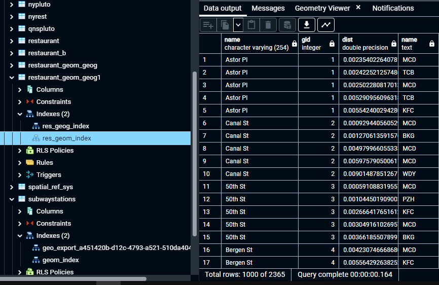

# GTECH785_Fall22

<b>SQL code and screenshots for Lab 7 </b><br>

<br>SQL Code for Task 1: <br>
```sql
--Updating asses values that are NULL of less than $1000 to the average value of the properties within 1000 meters
WITH pnb AS(
SELECT p.gid as gid, AVG(pb.assesstot) as avgval
FROM public.mappluto1 as p
JOIN public.mappluto1 as pb
ON ST_DWithin(p.geom, pb.geom, 800)
WHERE p.assesstot IS NULL OR p.assesstot < 100
GROUP BY p.gid)
UPDATE public.mappluto1 as p
SET assesstot = pnb.avgval
FROM pnb
WHERE (p.assesstot IS NULL OR p.assesstot < 100);
```
Results:<br>


<br>SQL Code for Task 2: <br>
```sql
--Setting the SRID of the subway stations shapefile
SELECT UpdateGeometrySRID('subwaystations', 'geom', 4326);
SELECT Find_SRID('public', 'subwaystations', 'geom');

--Finding the 5 closest fast food restaurants from each subway station
SELECT s.name, s.gid, rs.geom <-> s.geom dist, rs.name
FROM subwaystations s
CROSS JOIN LATERAL
(
SELECT r.id, r.name, r.geom
FROM restaurant_geom_geog1 r 
ORDER BY s.geom <-> r.geom
LIMIT 5
) AS rs;
```

Results:<br>



