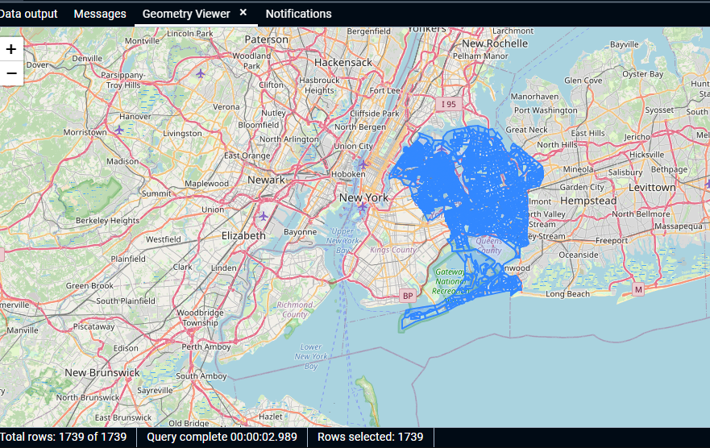
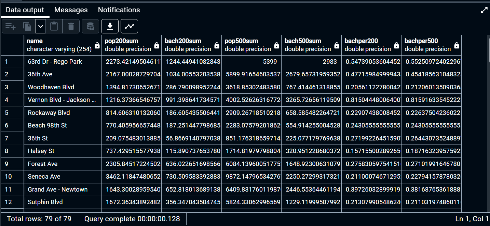

# GTECH785_Fall22

<b>SQL code and screenshots for Lab 8 </b><br>

<br>SQL Code for Task 1: <br>
```sql
--I loaded the block group shapefile into QGIS, the SRID is EPSG 4269, NAD 83
--Setting the SRID as 4269 and confirming it looks OK
CREATE TABLE nybg AS 
SELECT * FROM cb_2017_36_bg_500k;
SELECT UpdateGeometrySRID('nybg', 'geom', 4269);
SELECT Find_SRID('public', 'nybg', 'geom');
SELECT ST_Transform(geom, 4326) FROM nybg;

--Setting the geoid column to numeric, to match the education table
ALTER TABLE nybg
ALTER COLUMN geoid TYPE numeric USING geoid::numeric;

SELECT geoid::numeric
FROM nybg;

--Creating a spatial index on the block group table
CREATE INDEX bg_geom_index
ON nybg
USING GIST (geom);

--Calculating the total population with a bachelor's degree or higher
ALTER TABLE qns_ed
ADD COLUMN bach_higher numeric;
UPDATE qns_ed
SET bach_higher = bachelors + masters + professional + doctorate;

--Joining the Queens education table to the NY block group table
CREATE TABLE qnsed_geo AS
SELECT q.*, bg.affgeoid, bg.geom, bg.aland, bg.gid
FROM qns_ed as q
JOIN nybg as bg
ON q.geoid = bg.affgeoid;

--Displaying the Queens block groups on the basemap
SELECT ST_Transform(geom, 4326)
FROM qnsed_geo;
```
Results:<br>


<br>SQL Code for Task 2: <br>
```sql
--Calculating the percant of residents with a bachelors degree or higher in Queens block groups
--First deleting block groups with population = 0
DELETE FROM qnsed_geo
WHERE totalpop = 0;

ALTER TABLE qnsed_geo
ADD COLUMN bachpercent double precision;
UPDATE qnsed_geo
SET bachpercent = bach_higher / totalpop;

--Creating a spatial index on the Queens block group table
CREATE INDEX qns_geomm_index
ON qnsed_geo
USING GIST (geomm);

--Joining the subway station on Queens BG tables based on 200 and 500 meter buffers
CREATE TABLE qnsed_buf AS
WITH bg as
(
	SELECT *, ST_Transform(geom, 2831) as geomm1
	FROM qnsed_geo
), sub_buf200 as (
	SELECT *, ST_Buffer(ST_Transform(geom, 2831), 200) as geombuf1, ST_Buffer(ST_Transform(geom, 2831), 500) as geombuf2
	FROM subwaystations
)
SELECT b2.gid, b2.name, bg.*, 
ST_Area(ST_Intersection(b2.geombuf1, bg.geomm))/ST_Area(bg.geomm1) as dis200,
ST_Area(ST_Intersection(b2.geombuf2, bg.geomm))/ST_Area(bg.geomm1) as dis500
FROM sub_buf200 as b2
JOIN bg 
ON ST_Intersects(b2.geombuf1, bg.geomm);

--Multiplying the tract percent with the population and bachelor's degree values
ALTER TABLE qnsed_buf
ADD COLUMN pop200 double precision, ADD COLUMN bach200 double precision,
ADD COLUMN pop500 double precision, ADD COLUMN bach500 double precision;
UPDATE qnsed_buf
SET pop200 = dis200 * totalpop,
bach200 = dis200 * bach_higher,
pop500 = dis500 * totalpop,
bach500 = dis500 * bach_higher;

--Grouping by each subway station
CREATE TABLE qnsed200500 as
SELECT name, sum(pop200) as pop200sum, sum(bach200) as bach200sum,
sum(pop500) as pop500sum, sum(bach500) as bach500sum
FROM qnsed_buf
GROUP BY name;

--Calculating the percent of bachelor's degree or higher within 200 and 500 m of each station
ALTER TABLE qnsed200500
ADD COLUMN bachper200 double precision, ADD COLUMN bachper500 double precision;
UPDATE qnsed200500
SET bachper200 = bach200sum / pop200sum,
bachper500 = bach500sum / pop500sum;
```

Results:<br>



